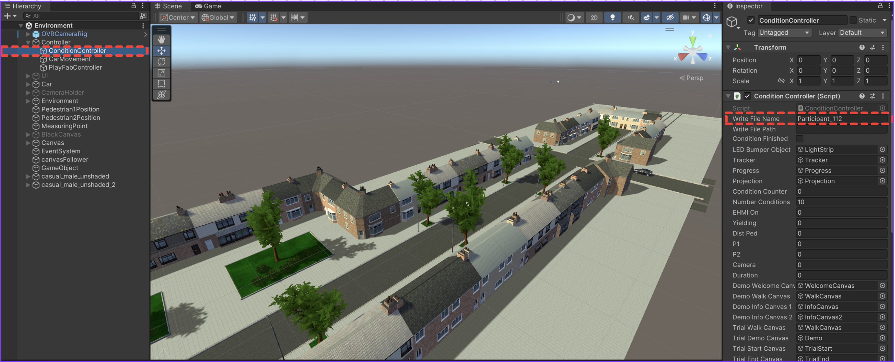
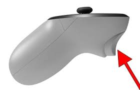

# Multi-pedestrian interaction with automated vehicle
Framework for the analysis of different sounds emitted by an automated car while pedestrian is crossing the road.

## Setup
Tested with Python 3.9.20. To setup the environment run these two commands in a parent folder of the downloaded repository (replace `/` with `\` and possibly add `--user` if on Windows):

**Step 1:**  

Clone the repository
```command line
git clone https://github.com/Shaadalam9/sound-ev
```

**Step 2:** 

Install Dependencies
```command line
pip install -r requirements.txt
```

**Step 3:**

Ensure you have the required datasets in the data/ directory.

**Step 4:**

Run the code:
```command line
python3 analysis.py
```

## Input
The simulator takes input from Meta Quest controller.


## Output
The simulator supports giving output to both a computer screen and a head-mounted display (HMD). It has been tested with Meta Quest 3.

## Installation
The simulator was tested on Windows 11 and macOS Sequoia 15.1.1. All functionality is supported by both platforms. However, support for input and output devices was tested only on Windows 11.

After checking out this project, launch Unity Hub to run the simulator with the correct version of Unity (currently **2022.3.5f1**).

## Configuration

The project is divided into three main scenes, located in the directory: `sound-unity/Assets/Scenes`. These scenes are structured as follows:

1. **MainMenu**:  
   - This is the introductory scene of the experiment. Participants are welcomed and briefed on the study objectives and procedures.

2. **Environment**:  
   - This scene contains all the experimental trials. Participants interact with the environment to record their willingness to cross the road under different conditions.

3. **EndMenu**:  
   - The final scene serves as a thank-you screen, providing closure to the experiment.

### Setup Instructions

1. **Participant ID Setup**:  
   Before starting the experiment, you must configure the participant's unique ID. This can be done by:
   - Navigating to the `ConditionController` in the **Hierarchy** tab.
   - Filling in the `Write File Name` field with the participant's unique name or number.

   Once this is complete, click the **Play** button to enter play mode.

   

---

## Experiment Interaction

### Recording Willingness to Cross the Road

Participants record their willingness to cross the road using the **trigger button** on the controller. The interaction process is illustrated in the image below:  



- **How to Record**:  
  Press the trigger button when you feel safe to cross the road.

---

## Data Collection

The experiment captures and saves data for analysis in the `data` folder. The folder structure is organized as follows:

1. **Participant-Specific Folder**:  
   - A unique folder is created for each participant, named after their unique ID with a timestamp.

2. **Contents of Each Folder**:  
   - **Mapping File**:  
     This file contains the sequence of trials. It can be used to link trial data with corresponding scenarios (using `video_id`).

   - **Trial Data**:  
     - For each trial, a CSV file is generated in the format `{Participant_ID}_{video_id}`.  
     - These files store the physical movements of the Head-Mounted Display (HMD) and controllers during the trial.

   - **Response Data**:  
     A separate CSV file is generated to store responses to the questions asked between trials.


## Contact
If you have any questions or suggestions, feel free to reach out to md_shadab_alam@outlook.com
