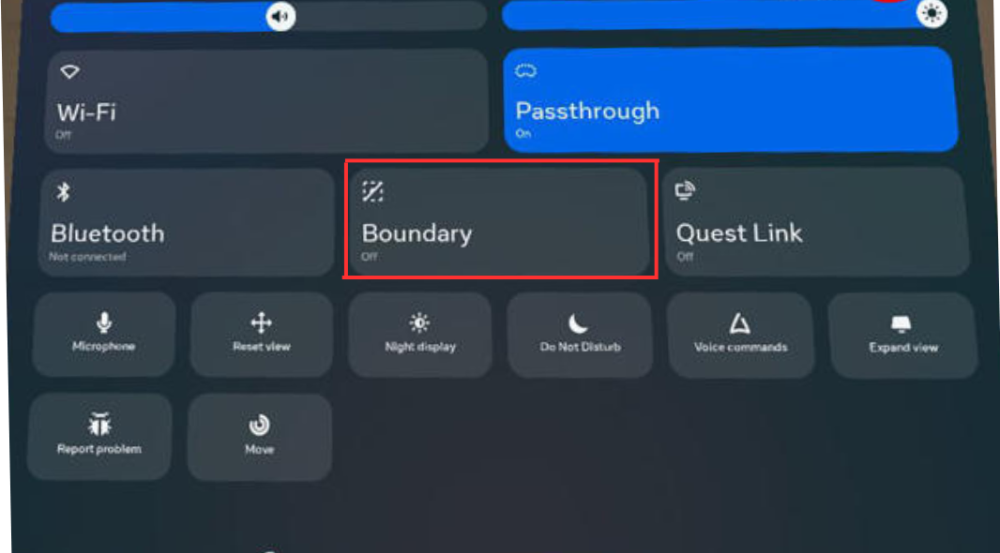

# Electric vehicles emitting sound
Framework for the analysis of different sounds emitted by an automated car while pedestrian is crossing the road.

## Setup
Tested with Python 3.9.20. To setup the environment run these two commands in a parent folder of the downloaded repository (replace `/` with `\` and possibly add `--user` if on Windows):

**Step 1:**  

Clone the repository
```command line
git clone https://github.com/Shaadalam9/sound-ev
```

**Step 2:** 

Install Dependencies
```command line
pip install -r requirements.txt
```

**Step 3:**

Ensure you have the required datasets in the data/ directory.

**Step 4:**

Run the code:
```command line
python3 analysis.py
```

## Configuration of project
Configuration of the project needs to be defined in `sound-ev/config`. Please use the `default.config` file for the required structure of the file. If no custom config file is provided, `default.config` is used. The config file has the following parameters:
* `mapping`: CSV file that contains all data found in the videos.
* `plotly_template`: template used to make graphs in the analysis.
* `output`: folder with output.
* `data`: folder with data.
* `input_csv`: data from intake questionnaire.
* `post_input_csv`: data from final questionnaire.

## Input
The simulator takes input from Meta Quest controller.


## Output
The simulator supports giving output to both a computer screen and a head-mounted display (HMD). It has been tested with Meta Quest 3.

## Installation
The simulator was tested on Windows 11 and macOS Sequoia 15.1.1. All functionality is supported by both platforms. However, support for input and output devices was tested only on Windows 11.

After checking out this project, launch Unity Hub to run the simulator with the correct version of Unity (currently **2022.3.5f1**).

## Configuration

The project is divided into three main scenes, located in the directory: `sound-unity/Assets/Scenes`. These scenes are structured as follows:

1. **MainMenu**:  
   - This is the introductory scene of the experiment. Participants are welcomed and briefed on the study objectives and procedures.

2. **Environment**:  
   - This scene contains all the experimental trials. Participants interact with the environment to record their willingness to cross the road under different conditions.

3. **EndMenu**:  
   - The final scene serves as a thank-you screen, providing closure to the experiment.

## Setup Instructions

### **Adjusting Participant Height**:
   Follow these steps to properly adjust the participant's height:

1. **Open the Settings Menu**
   - Access the **Settings** menu.
   - 

2. **Navigate to Physical Space**
   - Select the **Physical Space** option.
   - 

3. **Clear Boundary and Space Scan History**
   - Choose the option **Clear Boundary and Space Scan History** to reset any previous environment settings.
   - 

4. **Set Floor Level**
   - Click on **Set Floor Level** and adjust it to ensure the floor level is correctly calibrated.
   - 

5. **Set Boundary with Participant**
   - Return to the **Quick Settings** menu and have the participant wear the headset.
   - Instruct the participant to select **Boundary** from the menu.
   - 

6. **Ensure Correct Orientation**
   - Guide the participant to look down at their shoes to verify correct alignment and orientation.

7. **Confirm Boundary**
   - Ask the participant to press **Confirm Boundary** to finalize the setup.
   - 

8. **Hand Over Control**
   - Once the boundary is confirmed, the experimenter can take back the controller and headset.


### **Participant ID Setup**:  
Before starting the experiment, configure the participant's unique ID:

1. **Open the Environment Scene**
   - Navigate to **Assets > Scenes**.
   - Select the **Environment** scene.
   - 

2. **Modify the ConditionController**
   - Locate the `ConditionController` in the **Hierarchy** tab.
   - Fill in the `Write File Name` field with the participant's unique name or ID.
   - 


### **Connecting to Quest Link and Launching Unity**:
Set up the Unity environment and connect it to the Quest using the following steps:

1. **Launch Unity**
   - Ensure that Unity is open on your computer and the **MainMenu** environment is loaded.
   - 

2. **Open Quest Link**
   - Navigate to the **Settings** menu and select Quest Link via Meta Quest.
   - 

3. **Add Desktop Panel**
   - In Quest Link, click on **Add Desktop Panel**.
   - 

4. **Select Unity**
   - Choose Unity from the available options in the desktop panel.
   - 

5. **Verify Main Menu Scene**
   - Ensure the Main Menu scene is visible in the Quest.
   - Press the **Play** button in Unity to start the experiment.
   - 

6. **Participant Instructions**
   - Have the participant wear the headset.
   - Allow them to read the on-screen instructions before proceeding with the experiment.

7. **Resolving Overlapping Menus**
   - If another menu appears in front of the instructions:
     - 
     - Press the Meta button on the right controller to resolve the issue.
     - 


---

## Experiment Interaction

### Recording Willingness to Cross the Road

Participants record their willingness to cross the road using the **trigger button** on the controller. The interaction process is illustrated in the image below:  


- **How to Record**:  
  Press the trigger button when you feel safe to cross the road.

---

## Data Collection

The experiment captures and saves data for analysis in the `data` folder. The folder structure is organized as follows:

1. **Participant-Specific Folder**:  
   - A unique folder is created for each participant, named after their unique ID with a timestamp.

2. **Contents of Each Folder**:  
   - **Mapping File**:  
     This file contains the sequence of trials. It can be used to link trial data with corresponding scenarios (using `video_id`).

   - **Trial Data**:  
     - For each trial, a CSV file is generated in the format `{Participant_ID}_{video_id}`.  
     - These files store the physical movements of the Head-Mounted Display (HMD) and controllers during the trial.

   - **Response Data**:  
     A separate CSV file is generated to store responses to the questions asked between trials.

## Analysis
Analysis can be started by running python `sound-ev/analysis.py`. A number of CSV files used for data processing are saved in `sound-ev/_output/`. Visualisations of all data are saved in `sound-ev/_output/figures/`.

## Keypress data
[](https://htmlpreview.github.io/?https://github.com/Shaadalam9/sound-ev/blob/main/figures/all_videos_kp_slider_plot_TriggerValueRight.html)
Percentage of the participants who pressed the key (i.e. felt safe to cross in front of the EV) as a function of time for each sound stimulus. The vertical line represents the passing moment. The asterisks at the bottom indicate significant differences with respect to ’Diesel’ sound, p < 0.05.

## Head rotation
[](https://htmlpreview.github.io/?https://github.com/Shaadalam9/sound-ev/blob/main/figures/all_videos_yaw_angle_Yaw.html)
Mean yaw angle of head movement of pedestrians as a function of time for each sound stimulus. The value of 0 denotes participants looking perpendicular to the road, negative values correspond to the left direction (vehicle approach) and vice versa. The vertical line represents the passing moment. The asterisks at the bottom indicate significant differences with respect to 'Diesel' sound, p < 0.05.

[](https://htmlpreview.github.io/?https://github.com/Shaadalam9/sound-ev/blob/main/figures/histogram.html)
Histogram of yaw angle of head movement of pedestrians as a function of time for each sound stimulus. The value of 0 denotes participants looking perpendicular to the road, negative values correspond to the left direction (vehicle approach) and vice versa.

## Subjective responses
[](https://htmlpreview.github.io/?https://github.com/Shaadalam9/sound-ev/blob/main/figures/boxplot_repsonse.html)
Bar plots of the ratings for the questions regarding (top left) noticeability, (top right) informativeness, (bottom left) annoyance, and composite score (bottom right) per sound stimulus

[](https://htmlpreview.github.io/?https://github.com/Shaadalam9/sound-ev/blob/main/figures/bar_repsonse.html)
Box plots of the ratings for the questions regarding (top left) noticeability, (top right) informativeness, (bottom left) annoyance, and composite score (bottom right) per sound stimulus

## Information on participants
[](https://htmlpreview.github.io/?https://github.com/Shaadalam9/sound-ev/blob/main/figures/gender.html)
Gender of the participants.

[](https://htmlpreview.github.io/?https://github.com/Shaadalam9/sound-ev/blob/main/figures/age.html)
Age distribution of participants.

[](https://htmlpreview.github.io/?https://github.com/Shaadalam9/sound-ev/blob/main/figures/are_you_wearing_any_seeing_aids_during_the_experiments.html)
Are you wearing any seeing aids during the experiments?

[](https://htmlpreview.github.io/?https://github.com/Shaadalam9/sound-ev/blob/main/figures/at_which_age_did_you_obtain_your_first_license_for_driving_a_car_or_motorcycle.html)
At which age did you obtain your first license for driving a car or motorcycle?

[](https://htmlpreview.github.io/?https://github.com/Shaadalam9/sound-ev/blob/main/figures/what_is_your_primary_mode_of_transportation.html)
What is your primary mode of transportation?

[_did_you_drive_in_the_last_12_months.png?raw=true)](https://htmlpreview.github.io/?https://github.com/Shaadalam9/sound-ev/blob/main/figures/about_how_many_kilometers_(miles)_did_you_drive_in_the_last_12_months.html)
"About how many kilometers (miles) did you drive in the last 12 months?"

## Contact
If you have any questions or suggestions, feel free to reach out to md_shadab_alam@outlook.com or pavlo.bazilinskyy@gmail.com.
